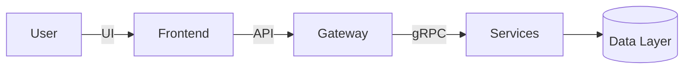

# Добро пожаловать в корпоративную базу знаний

<div class="kb-hero kb-hero--solo">
  <div class="kb-hero__body">
    <p class="kb-hero__eyebrow">Разводящая страница</p>
    <h1 class="kb-hero__title">Вход открыт после авторизации, далее — быстрый переход по разделам</h1>
    <p class="kb-hero__lead">
      Мы сохранили минимализм и стеклянные панели в стиле Apple. После входа вы сразу увидите ключевые области: Платформа, Процессы,
      How-to, Справочник, ViPNet и FAQ.
    </p>
    <div class="kb-hero__badge">Доступ к материалам только по проверенному логину</div>
    <div class="kb-hero__actions">
      <a class="cta" href="#kb-sections">Перейти к разделам</a>
      <a class="cta kb-hero__link" href="faq/index.md">Найти ответ в FAQ</a>
    </div>
  </div>
</div>

## Главные разделы

<div class="kb-hub" id="kb-sections">
  <div class="kb-hub__grid">
    <a class="kb-hub__card" href="platform/index.md">
      <div class="kb-hub__pill">Платформа</div>
      <h3>Архитектура и интеграции</h3>
      <p>Карты сервисов, API-каталоги, подключение внешних систем, схемы развертывания и контрольные чек-листы.</p>
      <span class="kb-hub__cta">Открыть платформу →</span>
    </a>
    <a class="kb-hub__card" href="processes/index.md">
      <div class="kb-hub__pill">Процессы</div>
      <h3>Регламенты и инциденты</h3>
      <p>Описания SLA, реагирование на инциденты, управление изменениями, risk management и роли команд.</p>
      <span class="kb-hub__cta">Открыть процессы →</span>
    </a>
    <a class="kb-hub__card" href="how-to/index.md">
      <div class="kb-hub__pill">How-to</div>
      <h3>Пошаговые инструкции</h3>
      <p>Шаблоны плейбуков, чек-листы для релизов, частые операции с инфраструктурой и пользовательские сценарии.</p>
      <span class="kb-hub__cta">Открыть How-to →</span>
    </a>
    <a class="kb-hub__card" href="reference/index.md">
      <div class="kb-hub__pill">Справочник</div>
      <h3>Глоссарии и политики</h3>
      <p>Термины, форматы данных, требования по безопасности, стандарты разработки и ссылки на нормативные документы.</p>
      <span class="kb-hub__cta">Открыть справочник →</span>
    </a>
    <a class="kb-hub__card" href="vipnet/index.md">
      <div class="kb-hub__pill">ViPNet</div>
      <h3>Защищённые сети</h3>
      <p>Подключение, сертификация, маршруты обмена, troubleshooting клиентских конфигураций и типовые кейсы.</p>
      <span class="kb-hub__cta">Открыть ViPNet →</span>
    </a>
    <a class="kb-hub__card" href="faq/index.md">
      <div class="kb-hub__pill">FAQ</div>
      <h3>Быстрые ответы</h3>
      <p>Самые частые вопросы по доступам, ролям, релизам и интеграциям, плюс ссылки на связанные инструкции.</p>
      <span class="kb-hub__cta">Открыть FAQ →</span>
    </a>
  </div>
</div>

## Как поддерживать качество контента

- Используйте единые шаблоны разделов: цель, шаги, артефакты, владельцы. Добавляйте теги и ссылки на соседние материалы для сквозной навигации.
- Делите материалы на **обзоры** и **детализацию**: обзорные страницы используют сводные таблицы и ссылки на дочерние статьи.
- Применяйте **адмонишены** для важных оговорок и статусов. Пример:

!!! warning "Требуется проверка SecOps"
    Включайте сюда требования по безопасности, ограничения и контрольные вопросы.

- Для SDK или сценариев в разных языках используйте **контентные табы**:

=== "Python"
    ```python
    import acme
    acme.Client(api_key="...")
    ```

=== "Go"
    ```go
    client := acme.NewClient("...")
    ```

## Навигация, поиск и визуализации

- Включены хлебные крошки, нижняя навигация и мгновенные переходы.
- Подсветка результатов поиска активна; при больших объёмах включайте обрезку навигации (`navigation.prune`).
- Для сложных потоков используйте mermaid:



- Для формул подключайте MathJax только на страницах, где это нужно.

## Что дальше

- Добавьте примеры и руководства в каждый раздел
- Приложите favicon и логотип
- Подключите CI для сборки и деплоя
