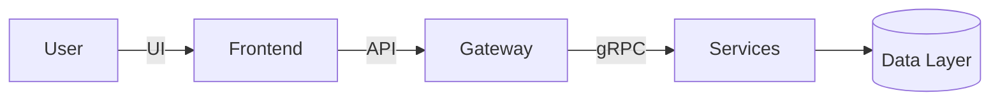

# Добро пожаловать в корпоративную базу знаний

<div class="kb-hero kb-hero--solo">
  <div class="kb-hero__body">
    <p class="kb-hero__eyebrow">Вся экспертиза — в одном месте</p>
    <h1 class="kb-hero__title">Минимализм, скорость и контроль в стиле Apple</h1>
    <p class="kb-hero__lead">
      Сайт построен на Zensical: мгновенная навигация, продуманные шаблоны и защищённый доступ только после авторизации.
    </p>
    <div class="kb-hero__badge">Доступ открывается после проверки учётных данных</div>
    <div class="kb-hero__actions">
      <a class="cta" href="platform/index.md">Перейти к платформе</a>
      <a class="cta kb-hero__link" href="faq/index.md">Найти ответ в FAQ</a>
    </div>
  </div>
</div>

## Быстрый старт

- 🚀 **Платформа** — архитектура, API и интеграции: [Перейти](platform/index.md)
- 📋 **Процессы** — регламенты, инциденты, риски: [Перейти](processes/index.md)
- 🛠️ **How-to** — пошаговые инструкции и плейбуки: [Перейти](how-to/index.md)
- 📚 **Справочник** — глоссарии, форматы данных, политики: [Перейти](reference/index.md)
- ❓ **FAQ** — часто задаваемые вопросы: [Перейти](faq/index.md)

!!! tip "Как поддерживать качество"
    Используйте единые шаблоны разделов: цель, шаги, артефакты, владельцы. Добавляйте теги и ссылки на соседние материалы для сквозной навигации.

## Рекомендации по авторству

- Делите материалы на **обзоры** и **детализацию**: обзорные страницы используют сводные таблицы и ссылки на дочерние статьи.
- Применяйте **адмонишены** для важных оговорок и статусов. Пример:

!!! warning "Требуется проверка SecOps"
    Включайте сюда требования по безопасности, ограничения и контрольные вопросы.

- Для SDK или сценариев в разных языках используйте **контентные табы**:

=== "Python"
    ```python
    import acme
    acme.Client(api_key="...")
    ```

=== "Go"
    ```go
    client := acme.NewClient("...")
    ```

## Навигация и поиск

- Включены хлебные крошки, нижняя навигация и мгновенные переходы.
- Подсветка результатов поиска активна; при больших объёмах включайте обрезку навигации (`navigation.prune`).

## Диаграммы и формулы

Используйте mermaid для потоков и архитектуры:



Для формул подключайте MathJax только на страницах, где это нужно.

## Что дальше

- Оформите разделы ниже
- Добавьте favicon и логотип
- Подключите CI для сборки и деплоя
