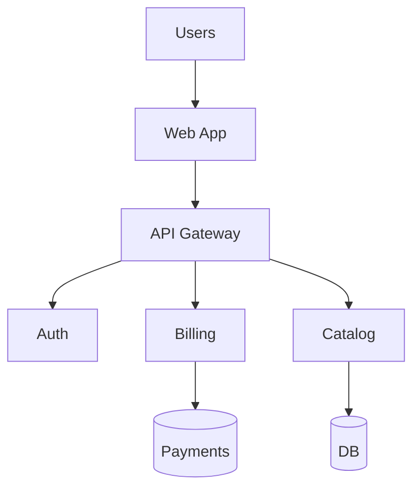

# Архитектурный обзор

!!! info "Цель"
    Дать целостное представление о сервисах, потоках данных и интеграциях.

## Карта сервисов

## Критические потоки

1. Аутентификация через gateway → Auth → токен.
2. Заказ: Web App → Gateway → Catalog → Billing → Payments.

## Нефункциональные требования

- Нагрузочное тестирование ≥ N RPS
- SLO для API: 99.9% доступность, p95 latency ≤ 250ms
- Обязателен circuit breaker на вызовы Billing/Payments

## Ссылки

- Диаграммы исходники: `docs/assets/diagrams/architecture.drawio` (хранить рядом с экспортами)
- См. также: [API](api.md)
